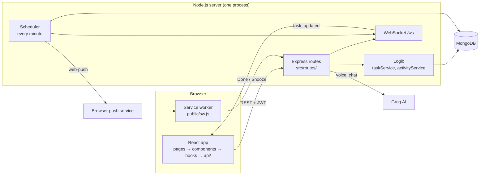

# Donezo

Donezo is a reminder app for the working day. You set a reminder like "every hour from 9 AM to
6 PM, but not during lunch", and your phone or computer gets a push notification each time.
Click the notification and write a short update on what you did. The app keeps a daily log of
those updates and shows the reminders you didn't answer as **Missed**.

## Key features

- **Time-window reminders**: repeat every 15 min, 30 min, 1 hour or a custom interval, inside a
  daily time range, with an optional lunch break. Each reminder has a category and an on/off switch.
- **Web Push notifications** with **Done** and **Snooze 10m** buttons that work even when the app is closed.
- **Updates**: write what you did for each reminder and pick how the session went
  (Productive / Average / Needs Improvement). Edit updates later and browse any past day with search.
- **Missed reminders**: reminders you never answered are listed, and you can still add an update for them.
- **Live sync**: open tabs and devices refresh by themselves over a WebSocket.
- **Voice input** (`/voice` page): speak a reminder and the AI (Groq) turns it into a draft you confirm.
- Login with email and password, light/dark theme, works on phones (installable web app).

## Technology stack

| Part | Tools |
|---|---|
| Frontend (`frontend/`) | React 19, TypeScript, Vite, Tailwind CSS, TanStack Query, Zustand, React Router, Radix UI |
| Backend (`server/`) | Node.js 20+, Express 5, MongoDB with Mongoose, JWT login, `web-push`, `ws` (WebSocket) |
| AI (optional) | Groq API, used for voice parsing and the chat endpoint |

## Project structure

| Path | What it holds |
|---|---|
| `frontend/` | React website |
| `frontend/public/sw.js` | Service worker: shows notifications and handles their buttons |
| `frontend/scripts/dev.mjs` | `npm run dev`: starts the server and the website together |
| `frontend/src/api/` | One file per server area (tasks, auth, activities, devices, voice) |
| `frontend/src/components/` | UI pieces (tasks, activity, layout, auth, voice, notifications) |
| `frontend/src/hooks/` | Data loading and app logic (useTasks, useAuth, useWebSocket, ...) |
| `frontend/src/pages/` | One file per page (Dashboard, Updates, Settings, ...) |
| `frontend/src/stores/` | Small global state (login, device id, WebSocket status) |
| `server/` | Node.js API + reminder timer (details in `server/README.md`) |
| `server/src/routes/` | The API endpoints |
| `server/src/models/` | MongoDB collections |
| `server/src/taskService.js` | Reminder rules: time windows, repeats, snooze, quiet hours |
| `server/src/jobs/` | The job that sends due reminders every minute |
| `backend/` | The old Python (FastAPI) version, kept only as a reference |
| `render.yaml` | How to deploy the server on Render |

## Architecture



**Layers**

| Side | Layer | Job |
|---|---|---|
| Frontend | `pages/` → `components/` | What the user sees |
| Frontend | `hooks/` (TanStack Query) | Load and cache data, run actions, show toasts |
| Frontend | `api/` (axios) | HTTP calls; adds the token and refreshes it on a `401` |
| Frontend | `stores/` (Zustand) | Login state, device id, WebSocket status |
| Server | `routes/` | Check the request, call the logic, send JSON back |
| Server | `taskService.js` and other services | Reminder rules, with no database code (easy to test) |
| Server | `models/` (Mongoose) | MongoDB collections |
| Server | `scheduler.js` → `jobs/` | Timer that sends due reminders |

**Life of a reminder**

1. **Create**: `POST /tasks` works out the first free slot in the time window and saves it as `next_due_at`.
2. **Due**: every minute the scheduler finds reminders with `next_due_at <= now`. If the user is in
   quiet hours it waits. Otherwise it saves a `ReminderLog`, pushes a notification to every device,
   moves `next_due_at` to the next slot, and tells open tabs over the WebSocket.
3. **Notify**: the browser's push service wakes `sw.js`, which shows the notification.
   **Done** / **Snooze** call `POST /tasks/:id/action` directly, without opening the app.
4. **Answer**: clicking the notification opens `/update/:taskId`; `POST /activities/submit` saves the update.
5. **Missed**: a `ReminderLog` with no matching update is returned by `GET /activities/missed`.

**Data (MongoDB models)**

| Model | Holds |
|---|---|
| `User` | Email, hashed password, time zone, settings |
| `Task` | One reminder: title, time window, lunch break, interval, `next_due_at`, status |
| `Device` | One browser's push subscription |
| `Activity` | The log: updates the user wrote and events like created / done / snoozed |
| `ReminderLog` | Every reminder that was sent (used to find missed ones) |
| `NotificationLog`, `RevokedToken` | Sent pushes; used refresh tokens (deleted automatically when expired) |
| `ChatMessage`, `CurrentTask`, `ProductivityLog` | Data for the AI chat endpoint |

**Design choices**

- One Node.js process runs both the API and the timer, so there is no worker, queue or Redis.
- All times are stored in UTC and converted to the user's time zone only for time windows
  and quiet hours, so "is it due?" is one simple comparison.
- API fields use `snake_case`, the same as the old Python backend, so the website didn't need changes.

## Prerequisites

- Node.js 20 or newer, and npm
- A MongoDB database: a free [MongoDB Atlas](https://www.mongodb.com/atlas) cluster or a local MongoDB
- VAPID keys for push notifications (generated below)
- Optional: a Groq API key from [console.groq.com](https://console.groq.com) for voice input

## Installation

```bash
git clone <your-repo-url>
cd Track-your-time-v2
cd server && npm install && cd ..
cd frontend && npm install && cd ..
cd server && npx web-push generate-vapid-keys   # once: prints a public and a private push key
```

## Environment variables

Copy `server/.env.example` to `server/.env`, and `frontend/.env.example` to `frontend/.env.local`.

| Variable | File | Required | What it is for |
|---|---|---|---|
| `MONGODB_URI` | server | yes | MongoDB connection string |
| `JWT_SECRET_KEY` | server | yes | Long random text used to sign login tokens |
| `CORS_ORIGINS` | server | no | Website addresses allowed to call the server, comma separated (default `http://localhost:5173`) |
| `PORT` | server | no | Port to listen on (default `8000`) |
| `VAPID_PUBLIC_KEY`, `VAPID_PRIVATE_KEY` | server | for push | The keys from `generate-vapid-keys` |
| `VAPID_CLAIMS_SUB` | server | for push | `mailto:` plus a real email address |
| `GROQ_API_KEY` | server | no | Turns on voice parsing and the chat endpoint |
| `GROQ_MODEL` | server | no | Groq model name (default `llama-3.3-70b-versatile`) |
| `DISABLE_SCHEDULER` | server | no | Set to `1` to turn the reminder timer off (useful for testing) |
| `VITE_API_URL` | frontend | yes | Server address, e.g. `http://localhost:8000` |
| `VITE_VAPID_PUBLIC_KEY` | frontend | for push | The **same** public key as the server's `VAPID_PUBLIC_KEY` |

Never commit `.env` files. The root `.gitignore` already skips them.

## Running the project

```bash
cd frontend
npm run dev        # starts the server on :8000 and the website on :5173
```

Open http://localhost:5173, create an account, and allow notifications. http://localhost:8000/health should return
`{"status":"ok","push":true}` (`push: false` means the VAPID keys are missing or wrong). Other commands:

| Where | Command | What it does |
|---|---|---|
| `server/` | `npm run dev` | Server only, restarts when a file changes |
| `server/` | `npm start` | Server only, production mode |
| `frontend/` | `npm run dev:web` | Website only |
| `frontend/` | `npm run build` | Type-check and build the website into `frontend/dist` |
| `frontend/` | `npm run lint` | Check the code with oxlint |

## API overview

All endpoints except signup, login, refresh and `/health` need the header
`Authorization: Bearer <access_token>`. Errors come back as `{ "detail": "message" }`.

| Area | Endpoints |
|---|---|
| Auth | `POST /auth/signup`, `POST /auth/login`, `POST /auth/refresh`, `POST /auth/logout`, `GET /auth/me`, `PATCH /auth/me` |
| Reminders | `GET /tasks`, `GET /tasks/recent`, `POST /tasks`, `PATCH /tasks/:id`, `DELETE /tasks/:id` |
| Reminder actions | `POST /tasks/:id/action` with `action` = `done`, `snooze`, `start`, `block` or `reopen` |
| Voice | `POST /tasks/parse-voice` turns a sentence into a draft reminder (nothing is saved) |
| Updates | `GET /activities`, `GET /activities/missed`, `POST /activities/submit`, `PATCH /activities/:id` |
| Devices | `POST /devices`, `GET /devices`, `POST /devices/:id/ping`, `POST /devices/test-push` |
| AI chat | `POST /companion/chat`, `GET /companion/chat/history`, `GET` / `POST /companion/current-task` |
| Live updates | WebSocket at `/ws?token=<access_token>` |

Login uses an **access token** (7 days) sent with each request and a one-time **refresh token** (14 days)
that gets a new pair. The website refreshes before the access token expires and after any `401`.

## Deployment

- **Server**: `render.yaml` deploys `server/` on Render with its `Dockerfile`. The timer lives inside the server,
  so it must stay awake: on a free plan that sleeps, ping `/health` every few minutes (e.g. UptimeRobot).
- **Website**: any static host. `frontend/vercel.json` sends every path to `index.html` so links work on Vercel.
  Set `VITE_API_URL` and `VITE_VAPID_PUBLIC_KEY` in the host's settings.
- Add the website's address to the server's `CORS_ORIGINS`.
